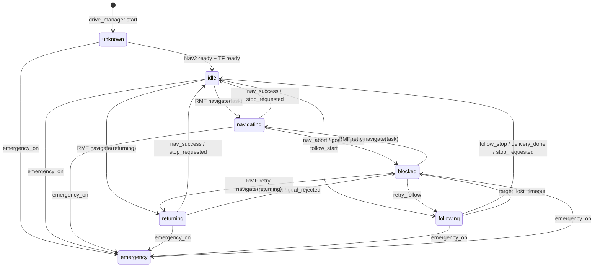

# Pinky Drive State Diagram

## MVP Event Names

| Event | Meaning |
|---|---|
| `RMF navigate(task)` | RMF requests movement to a task destination. |
| `RMF navigate(returning)` | RMF requests return movement. |
| `follow_start` | User starts person-following mode. |
| `follow_stop` | User manually stops person-following mode. |
| `delivery_done` | Delivery support flow is completed. |
| `target_lost_timeout` | YOLO/person tracking target is lost longer than the allowed timeout. |
| `nav_success` | Nav2 reports `SUCCEEDED`. |
| `nav_abort` | Nav2 reports `ABORTED`. |
| `goal_rejected` | Nav2 rejects the goal. |
| `stop_requested` | `stop` service or equivalent operator stop is requested. |
| `retry_follow` | Person-following mode is retried from `blocked`. |
| `RMF retry navigate(task)` | RMF retries task navigation from `blocked`. |
| `RMF retry navigate(returning)` | RMF retries return navigation from `blocked`. |
| `emergency_on` | Emergency topic becomes `true`. |
